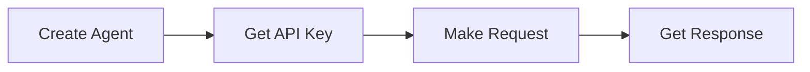

import { Callout } from 'vocs/components'

# Introduction

AI agent infrastructure platform. Deploy, manage, and interact with agents at scale.

## Quick Overview

| Feature | What it does |
|---------|-------------|
| 🔐 **Agent-scoped keys** | Each agent gets its own API keys |
| ⚡ **Real-time streaming** | Live responses via Server-Sent Events |
| 🛠 **Tool integration** | Connect external tools via MCP |
| 📊 **Usage tracking** | Monitor tokens and costs |

## Start Here

1. **[Quick Start →](/quick-start)** - 5-minute setup
2. **[API Reference →](/api/)** - Complete endpoints  
3. **[Examples →](/examples/javascript)** - Copy-paste code

## Two API Endpoints

<Callout type="tip">
**Simple Request/Response** - Use `/invoke` for complete answers in one call.
</Callout>

<Callout type="info">
**Real-time Streaming** - Use `/invoke/stream` for live token-by-token responses.
</Callout>

## Common Use Cases

- Chat interfaces
- Content generation  
- Data analysis
- Workflow automation
